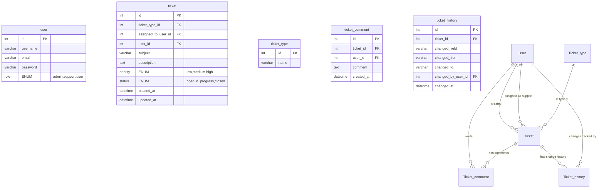

```mermaid
erDiagram
    user {
        int id PK
        varchar username
        varchar email
        varchar password
        role ENUM "admin,support,user"
    }
    ticket {
        int id PK
        int ticket_type_id FK
        int assigned_to_user_id FK
        int user_id FK
        varchar subject
        text description
        priority ENUM "low,medium,high"
        status ENUM "open,in_progress,closed"
        datetime created_at
        datetime updated_at
    }
    ticket_type {
        int id PK
        varchar name
    }
    ticket_comment {
        int id PK
        int ticket_id FK
        int user_id FK
        text comment
        datetime created_at
    }
    ticket_history {
        int id PK
        int ticket_id FK
        varchar changed_field 
        varchar changed_from
        varchar changed_to
        int changed_by_user_id FK
        datetime changed_at
    }

    %% Relations
        User ||--o{ Ticket : "created"
        User ||--o{ Ticket_comment : "wrote"
        User ||--o{ Ticket : "assigned as support"
        Ticket_type ||--o{ Ticket : "is type of"
        Ticket ||--o{ Ticket_comment : "has comments"
        Ticket ||--o{ Ticket_history : "has change history"
        User ||--o{ Ticket_history : "changes tracked by"
```