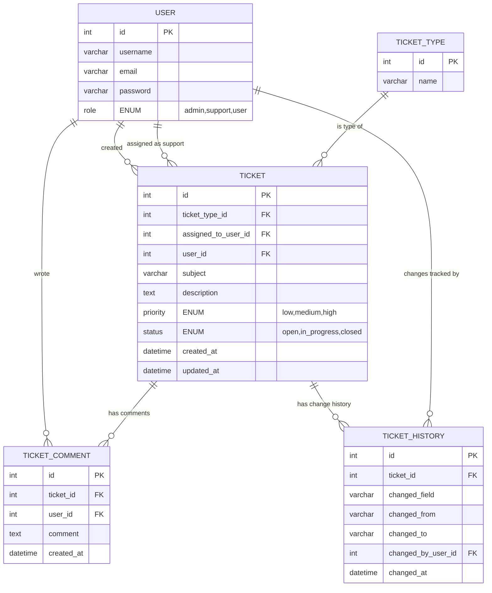

```mermaid
erDiagram
    USER {
        int id PK
        varchar username
        varchar email
        varchar password
        role ENUM "admin,support,user"
    }
    TICKET {
        int id PK
        int ticket_type_id FK
        int assigned_to_user_id FK
        int user_id FK
        varchar subject
        text description
        priority ENUM "low,medium,high"
        status ENUM "open,in_progress,closed"
        datetime created_at
        datetime updated_at
    }
    TICKET_TYPE {
        int id PK
        varchar name
    }
    TICKET_COMMENT {
        int id PK
        int ticket_id FK
        int user_id FK
        text comment
        datetime created_at
    }
    TICKET_HISTORY {
        int id PK
        int ticket_id FK
        varchar changed_field 
        varchar changed_from
        varchar changed_to
        int changed_by_user_id FK
        datetime changed_at
    }

    %% Relations
        USER ||--o{ TICKET : "created"
        USER ||--o{ TICKET_COMMENT : "wrote"
        USER ||--o{ TICKET : "assigned as support"
        TICKET_TYPE ||--o{ TICKET : "is type of"
        TICKET ||--o{ TICKET_COMMENT : "has comments"
        TICKET ||--o{ TICKET_HISTORY : "has change history"
        USER ||--o{ TICKET_HISTORY : "changes tracked by"
```